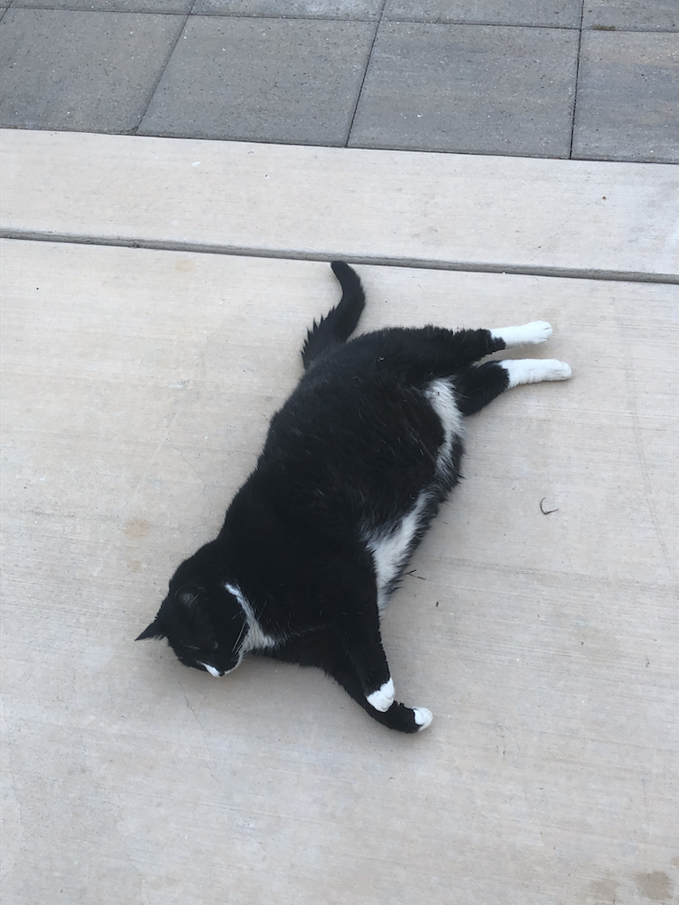
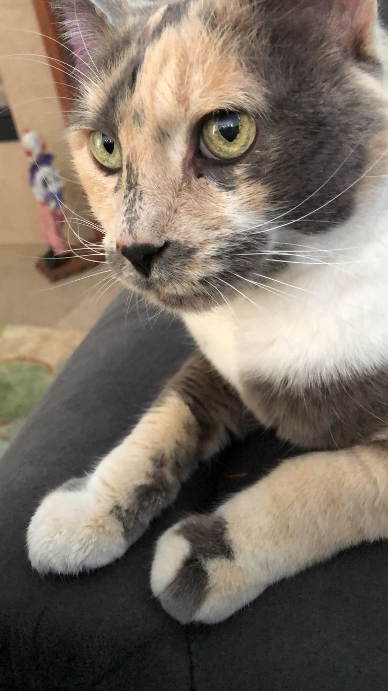

# Who am I?

Hello! My name is Donald Wolfson, I'm a third year Computer Science Major at the University of California, San Diego. I'm also a research intern at the Center for Applied Internet Data Analysis, based at the San Diego Supercomputer Center. I don't have a favorite programming language, but I'll list the ones I know in the order of how happy I would be to work with them:

1. C++
2. Python
3. Java
4. C
5. C#
6. ~~JavaScript~~

## What do I look like?

It's not that big of a secret! But for now, you can enjoy this image I made with Adobe Illustrator of myself.

## A Cool Concept I've learned

One of the more interesting things I've learned during my time at my CAIDA are *Regular Expressions*. They're an interesting way to find substrings using a variety of syntaxes, and can be very powerful. Below is a simply example in Python on how to search for the word the `the` inside of the given string. The sky is the limit with Regular Expressions.

~~~python
import re
re_the = re.compile(r"the")

if re_the.search("Winnie the Pooh"):
    print("True")
else:
    print("False")
~~~

## Grocery List

I need to keep track of the food I'm going to get from the grocery store. Since you're already here, I'm sure you'd like to see my list as well, so here it is:

[ ] :banana:
[ ] :green_apple:
[ ] :garlic:
[ ] :bread:
[ ] :cheese:
[ ] :ramen:
[ ] :shrimp:

## Links and what type of emotions they create

This [link](https://cse.ucsd.edu/index.php/undergraduate/tentative-course-offerings) creates stress.

This [link](https://www.youtube.com/) creates relaxation.

And this [link](https://www.reddit.com/) is one of my favorite pass times.

## An Interesting Quote I've Found

Here is the first quote I found after looking up interesting code related quotes. As the wise **Martin Fowler** once said:

> Any fool can write code that a computer can understand. Good programmers write code that humans can understand.

## My Cats

Below are images of my mom's cats. They are my chonkers, one is very chonky (summer), and the other is very old (Cali). They both don't like each other, so sadly there will be seperate images:

| Summer | Cali |
|:------:|:----:|
|  |  |
